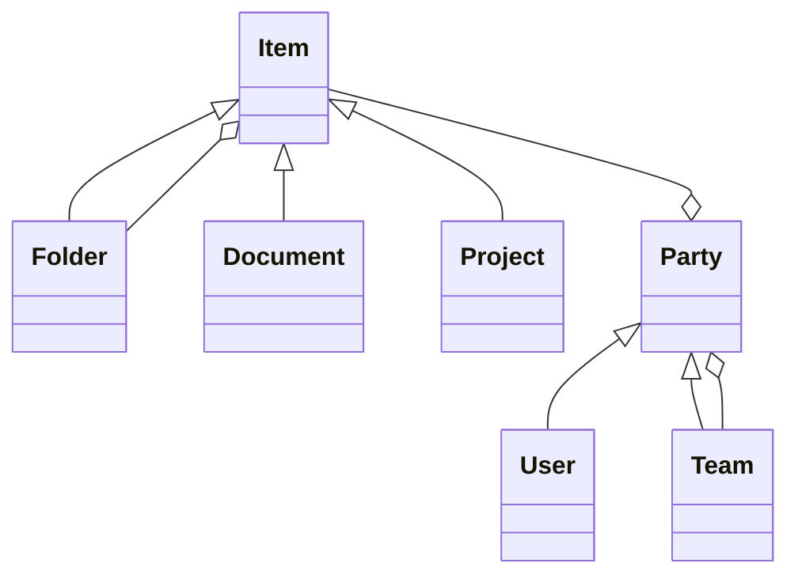

# AuthZ Service with OpenFGA

## Spec

Assuming its like Google services.

### Entities

* (nested) Folder
* Document (with versions)
* Project
* User
* (nested) Team

```mermaid
classDiagram
    class Item
    class Folder
    class Document
    class Project
    class Party
    class User
    class Team
    Folder --o Item
    Item <|-- Folder
    Item <|-- Document
    Item <|-- Project
    Party <|-- User
    Party <|-- Team
    Team --o Party
    Item --o Party
```
